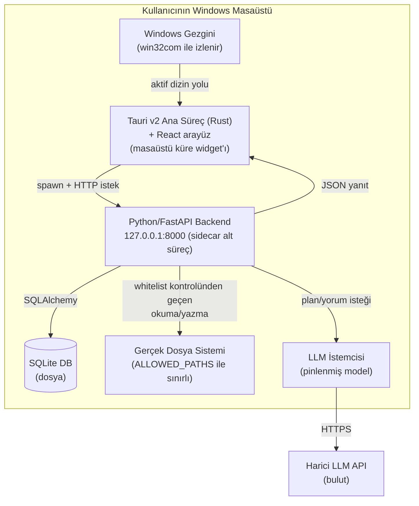
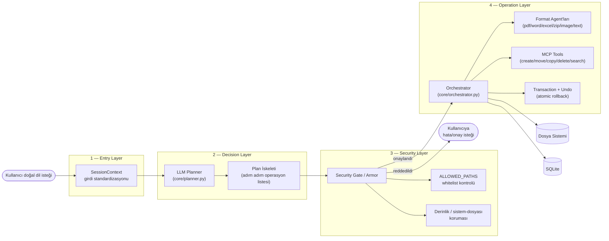

# windows-ai-files — Üst Seviye Tasarım Kararları

> Bu proje 2026-08-16'da sıfırdan yeniden yazılmaya başlandı. Eski kod
> `../referans/windows-ai-files-eski/` altında referans olarak duruyor.
> Ürün vizyonu ve teknoloji yığını eskisiyle aynı — hedef, aynı işlevi
> daha temiz bir mimari ve kod organizasyonuyla yeniden kurmak.

## 1. Ürün Vizyonu

Windows Gezgini ile tam entegre çalışan, arka planda aktif dizini takip eden,
kullanıcının doğal dilde verdiği isteklere göre dosya yönetim işlemlerini
(oluşturma, taşıma, silme, yeniden adlandırma, arama, belge dönüştürme)
gerçekleştiren bir masaüstü AI asistanı.

**Hedef kullanıcı:** Türkiye pazarı — muhasebeci/avukat gibi günlük yoğun
dosya/belge trafiği olan, teknik olmayan masaüstü kullanıcıları.

**Temel değer önerisi:** "Faturaları müşteri adına göre klasörle",
"geçen ayki PDF'leri Excel'e çıkar" gibi doğal dilde istekleri, güvenlik
katmanından geçirip geri alınabilir (undo edilebilir) şekilde uygulamak.

## 2. Karar Tablosu (ADR özeti)

| # | Karar | Seçenek | Gerekçe |
|---|-------|---------|---------|
| D1 | Backend dili/çatısı | Python 3.11+ / FastAPI | Eski projeden korunuyor — LLM entegrasyonu, dosya sistemi işlemleri, PDF/Office kütüphaneleri Python ekosisteminde olgun. |
| D2 | Frontend | **Tauri v2** + React (eski karar: Electron) | 2026 karşılaştırması: Tauri kurulum ~5MB (Electron ~150MB), RAM 30-50MB (Electron 150-300MB), %40 daha hızlı açılış — küçük "masaüstü küre" widget'ı için önemli. Python backend'i ayrı süreç (`sidecar`) olarak çağırma modeli (D3) aynen korunur, sadece native kabuk Rust'a geçer, React arayüz kodu büyük ölçüde taşınabilir. Kaynak: [Rustify](https://rustify.rs/articles/rust-tauri-vs-electron-2026), [Tech Insider](https://tech-insider.org/tauri-vs-electron-2026/) (2026-08 arama). |
| D3 | Backend↔Frontend iletişimi | Yerel HTTP (`127.0.0.1:8000`) | Tauri ana süreci Python backend'i sidecar alt süreç olarak başlatır, `/api/*` uç noktalarıyla polling/istek yapar. Basit, hata ayıklaması kolay; WebSocket sadece gerçek zamanlı akış (streaming yanıt) gerekirse D3b olarak ayrıca değerlendirilir. |
| D4 | Veritabanı | SQLite + SQLAlchemy ORM | Tek kullanıcılı masaüstü uygulaması, ayrı bir DB sunucusu gereksiz; dosya/analiz/kural/undo geçmişi için yeterli. |
| D5 | LLM planlama modeli | Pinlenmiş model kimliği (env değişkeniyle override edilebilir) | Eski projede pinlenmemiş model seçimi "sessiz no-op" hatalarına yol açmıştı (bkz. [[copilot-codex-gecisi]] hafıza notu) — aynı tuzağa düşmemek için baştan zorunlu. |
| D6 | Güvenlik mimarisi | 4 katmanlı: Entry → Decision → Security → Operation | Kullanıcı girdisi asla doğrudan dosya sistemine dokunmaz; her adımda ayrı bir doğrulama sınırı var (bkz. §4 mantıksal diyagram). |
| D7 | Geri alma (undo) modeli | Transaction + FileOperation tablosu, `backup_path` ile fiziksel yedek | Toplu işlemde bir adım başarısız olursa o ana kadarki tüm adımlar ters sırayla geri alınır (atomic rollback). |
| D8 | Dosya erişim izni | Whitelist (`ALLOWED_PATHS`) + derinlik/sistem-dosyası koruması | Kullanıcının belirlediği klasörler dışına (örn. `C:\Windows\System32`) hiçbir işlem yazılamaz. |
| D9 | Belge-format işleme | Ayrı "agent" modülleri (pdf/word/excel/zip/image/text) | Her format kendi bağımlılık/hata yüzeyini izole eder, tek bir "her şeyi yapan" modül yerine. |
| D10 | Paketleme/dağıtım | **Nuitka** (backend, eski karar: PyInstaller) + Tauri bundler (frontend), Inno Setup kurulum paketi | Nuitka Python'ı C'ye derliyor: açılış ~140-380ms (PyInstaller ~470-760ms) ve decompile edilmesi çok daha zor — ticari satılacak bir ürün için (bkz. [[urunlestirme-plani]] hafıza notu) IP koruması değerli. Bedel: derleme süresi uzar ama bu yalnızca paketleme anında, geliştirme döngüsünde değil. Kaynak: [iNEWS karşılaştırması](https://inf.news/en/tech/73e49bc3890cc7596d7a1e851222c2c4.html) (2026-08 arama). |
| D11 | Kod haritası/hafıza disiplini | `CODE_MAP.md` (self-regenerating, git hook) + `content.md` (mimari özeti) | Eski projede bu ikisi güncel tutulmayınca (bkz. reorg epic'leri) yanlış varsayımlarla kod yazılmasına yol açmıştı — süreç aynen korunuyor, baştan itibaren uygulanacak. |

## 3. Fiziksel Tasarım (Deployment / Process View)

**Notlar:**
- Backend, Tauri tarafından her başlangıçta sidecar alt süreç olarak başlatılır;
  bağımsız bir servis olarak arka planda kalıcı çalışmaz (kullanıcı uygulamayı
  kapattığında backend de kapanır).
- SQLite dosyası kullanıcı profili altında saklanır, kurulum paketiyle
  birlikte dağıtılmaz (ilk çalıştırmada oluşturulur).
- Harici LLM API çağrıları yalnızca plan üretimi/belge analizi için yapılır;
  dosya içeriği asla LLM'e bütün olarak gönderilmez (yalnızca ilgili
  metadata/özet — kapsam D-serisi karar olarak ilerleyen bir round'da netleşir).

## 4. Mantıksal Diyagram (Component View — 4 Katmanlı Güvenlik Mimarisi)

**Katman sorumlulukları (özet):**

| Katman | Sorumluluk | Girdi başarısız olursa |
|---|---|---|
| Entry | Kullanıcı girdisini normalize eder, oturum bağlamı kurar | Girdi reddedilir, kullanıcıya net hata döner |
| Decision | LLM ile adım adım plan üretir (plan-skeleton) | Plan üretilemezse fallback yok — net hata (eski projedeki "sessiz no-op" dersinden, bkz. D5) |
| Security | Her planlanan operasyonu whitelist + derinlik + sistem-dosyası kurallarına karşı doğrular | Operasyon tamamen reddedilir, hiçbir adım diske yazılmaz |
| Operation | Onaylanan planı gerçek dosya sisteminde/DB'de uygular, hata durumunda transaction'ı geri alır | Kısmi başarı durumunda o ana kadarki adımlar ters sırayla undo edilir |

## 5. Sıradaki Adım

Bu doküman onaylandıktan sonra, MVP çekirdek akış (kullanıcı girişi/ilk kayıt,
ana sohbet arayüzü, uçtan uca bir dosya operasyonu) UI/UX detayına kadar
Codex tarafından epic+task olarak üretilip Saga'ya işlenecek
(proje id: 2, bkz. Saga `windows-ai-files`).

## 6. Operasyon-özel `PlanStep` alanları için test konvansiyonu (Saga #319)

**Sorun (referans projeden ders):** `referans/windows-ai-files-eski`'de
tekrarlayan bir bug sınıfı vardı — şema bir parametre adı bildiriyordu
(örn. "box"), gerçek `execute` fonksiyonu FARKLI bir isim okuyordu
(left/top/right/bottom), alan sessizce yok sayılıyor, işlem YANLIŞ bir
şeyi yapıyordu ama `success: True` raporluyordu.

**Kural — bu projede `backend/models.py`'nin `PlanStep`'ine yeni bir
operasyon-özel alan eklendiğinde (yalnızca belirli `operationType`
değerleri için anlamlı, örn. gelecekteki Image için `cropBox`, Zip için
`extractToFolder` — bkz. Saga #320-#329) ZORUNLU:**

1. **Şema tarafı** — `newFileNames`/`mergedFileName` deseniyle aynı:
   `model_validator(mode="after")` ile "alan SADECE bu operationType'ta
   dolu olmalı, diğerlerinde None/eksik olmalı" kuralı eklenir
   (bkz. `models.py`'de `new_file_names_only_for_rename`,
   `merged_file_name_only_for_merge`).
2. **Wiring testi (ZORUNLU, orchestrator seviyesinde, mock YOK)** —
   `backend/tests/test_orchestrator.py`'ye alanın EN AZ İKİ farklı
   değeriyle `apply_plan`'ı çağıran, ve GERÇEK dosya sisteminde İKİ
   FARKLI somut çıktı (dosya adı/yolu/sayfa sayısı/içerik) gözlenen bir
   test eklenir. Tek bir sabit değerle test etmek YETERSİZDİR — kod
   alanı yoksayıp sabit bir davranış uygulasa bile öyle bir test yeşil
   kalabilir. Örnekler (Saga #319'da eklendi):
   - `test_apply_plan_rename_output_filename_changes_when_new_file_names_changes`
     — üç farklı `newFileNames` değeri, üç farklı çıktı dosya adı.
   - `test_apply_plan_merge_output_filename_changes_when_merged_file_name_changes`
     — iki farklı `mergedFileName` değeri, iki farklı çıktı dosya adı,
     birbirine sızmadığı da doğrulanıyor.
3. **Negatif test** — alan zorunlu olduğu `operationType`'ta eksikken,
   ve zorunlu OLMADIĞI bir `operationType`'ta doluyken `ValidationError`
   fırlatıldığı `backend/tests/test_models.py`'de doğrulanır (mevcut
   `newFileNames`/`mergedFileName` testleri örnek alınır).

**Kapsam dışı bırakılan (bilinçli karar):** AST/statik-analiz tabanlı
"her PlanStep alanı orchestrator'da okunuyor mu" otomatik kontrolü
KURULMADI — orantısız karmaşıklık ve yanlış pozitif/negatif riski
(bir alan helper fonksiyon üzerinden dolaylı okunabilir, statik analiz
bunu kaçırabilir) nedeniyle. Bunun yerine bu dökümante edilmiş
konvansiyon + red-team incelemesinin (bkz. `red-team` skill) her yeni
operasyon-özel alan için bu üç maddeyi kontrol etmesi tercih edildi.
